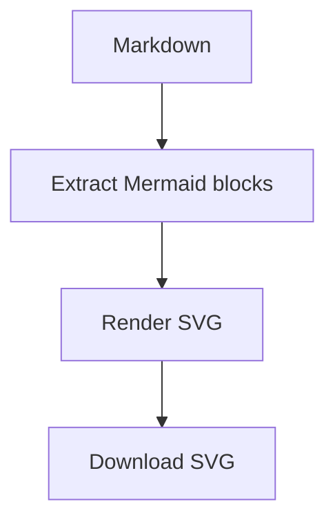

# Mermaid SVG Exporter

A pure frontend, vanilla JavaScript web app that extracts Mermaid diagrams from Markdown and lets you download each diagram as SVG.

Online version: <https://christorng.github.io/mermaid2svg/>

## Features

- Upload a `.md` or `.markdown` file.
- Paste complete Markdown content directly into the page.
- Detect every fenced Mermaid block, including blocks that start with ```` ```mermaid ```` or `~~~mermaid`.
- Render diagrams automatically after Markdown content changes.
- Render each Mermaid diagram as an inline SVG preview.
- Download each diagram individually as SVG.
- Download all rendered diagrams as an SVG ZIP.
- Runs entirely in the browser. No backend service and no build step are required.

## Usage

1. Open <https://christorng.github.io/mermaid2svg/>.
2. Upload a Markdown file or paste Markdown content.
3. Use **Download SVG** on each rendered diagram.
4. Use **Download SVG ZIP** to export every successfully rendered diagram at once.

Example Markdown:

````markdown

````

## Local Development

This is a static site. You can open `index.html` directly in a browser, or serve the folder with any static file server.

Example:

```powershell
python -m http.server 8000
```

Then open <http://localhost:8000/>.

## Deployment

This repository is intended to be deployed with GitHub Pages at:

<https://christorng.github.io/mermaid2svg/>

Because the app is static, GitHub Pages can serve the repository root directly.

## Notes

- Mermaid is loaded in the browser from jsDelivr.
- Exported SVG files include inline styles and a common Traditional Chinese font fallback stack for better compatibility with Word.
- ZIP export is generated client-side with JSZip.
- Markdown parsing is focused on fenced Mermaid code blocks, not full Markdown rendering.
